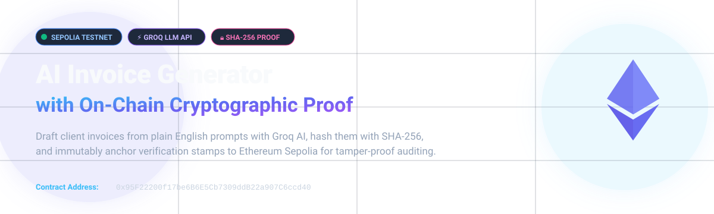
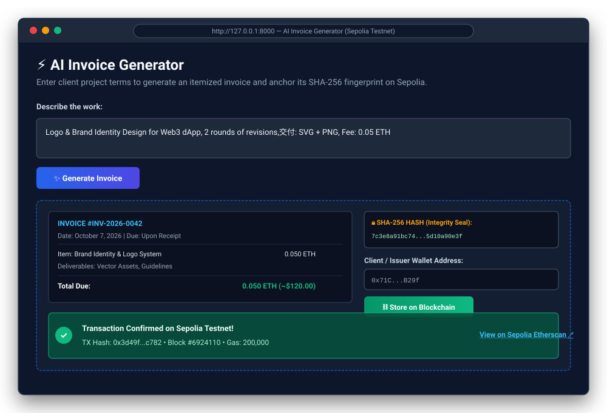
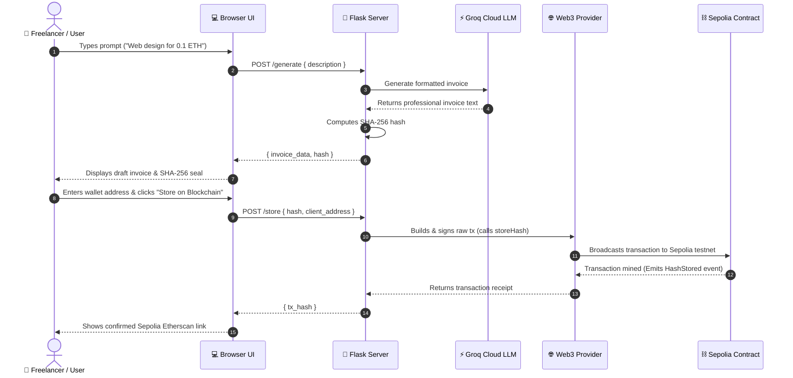

# 🧾 AI Invoice Generator with On-Chain Proof

<p align="center">
  
</p>

<p align="center">
  <a href="https://github.com/ishaanbhatt31/ai-invoice-hackathon/stargazers"></a>
  <a href="https://github.com/ishaanbhatt31/ai-invoice-hackathon/network/members"></a>
  <a href="https://sepolia.etherscan.io/address/0x95F22200f17be6B6E5Cb7309ddB22a907C6ccd40"></a>
  <a href="https://console.groq.com"></a>
  <a href="https://www.python.org/"></a>
  <a href="https://flask.palletsprojects.com/"></a>
  <a href="https://soliditylang.org/"></a>
  <a href="LICENSE"></a>
</p>

---

## 📌 Executive Summary

Freelancers, digital agencies, and small businesses face recurring friction around invoice tampering, disputed line items, and delayed settlements. Traditional PDF invoices can easily be altered after receipt, creating costly disputes.

**AI Invoice Generator with On-Chain Proof** bridges cutting-edge Large Language Models with Ethereum smart contracts. Users draft itemized, professional invoices by simply typing natural language descriptions. The backend computes a deterministic **SHA-256 cryptographic fingerprint** of the invoice and permanently anchors it onto the **Ethereum Sepolia Testnet**.

This gives both clients and freelancers an **immutable, mathematically verifiable seal of proof** without exposing private invoice contents on a public blockchain ledger.

---

## ✨ Key Features

- ⚡ **Natural Language to Itemized Invoice**: Transforms free-form project briefs (e.g., *"Logo and branding identity for 0.05 ETH"*) into structured invoices using Groq's high-throughput LLM (`openai/gpt-oss-120b`).
- 🔒 **Cryptographic Integrity Hash**: Automatically computes a standard SHA-256 hash digest of the full invoice document before submission.
- ⛓️ **On-Chain Notarization**: Submits and records the invoice hash directly to an Ethereum smart contract on Sepolia, binding the invoice to the issuer's address.
- 🛡️ **Zero-Knowledge Privacy & Cost Efficiency**: The full sensitive invoice is kept off-chain, minimizing blockchain storage costs while keeping client terms confidential. Only the 256-bit hash fingerprint is recorded on-chain.
- 🔍 **One-Click Etherscan Audit**: Generates instant direct links to the public Sepolia Etherscan explorer for transparent verification by accounting teams, auditors, and clients.
- 🚫 **Duplicate Prevention**: The deployed Solidity contract actively prevents re-registering previously claimed invoice hashes (`require(invoiceIssuers[_hash] == address(0))`).

---

## 🖼️ Application Preview

<p align="center">
  
</p>

> [!TIP]
> **Want to insert your live browser screenshots?**
> Capture your live browser window running `http://127.0.0.1:8000` and the Sepolia Etherscan confirmation page, place them in the [`assets/screenshots/`](assets/screenshots/) directory, and link them here!

---

## 🏛️ System Architecture

```mermaid
flowchart TD
    subgraph Client["🖥️ Frontend (Web UI)"]
        UI["Web Interface (index.html)"]
        Input["Prompt Input & Wallet Field"]
        Display["Invoice Display & Hash Viewer"]
    end

    subgraph Backend["⚙️ Flask REST API (backend/app.py)"]
        GenRoute["/generate endpoint"]
        StoreRoute["/store endpoint"]
        Hasher["SHA-256 Deterministic Hasher"]
        Web3Signer["Web3.py Transaction Builder & Signer"]
    end

    subgraph External["🌐 External Services & Blockchain"]
        Groq["⚡ Groq API (gpt-oss-120b)"]
        RPC["📡 Sepolia RPC Provider (PublicNode)"]
        Contract["📜 InvoiceRegistry Smart Contract\n0x95F22200f17be6B6E5Cb7309ddB22a907C6ccd40"]
        Etherscan["🔍 Sepolia Etherscan Explorer"]
    end

    Input -->|1. Prompt Description| GenRoute
    GenRoute -->|2. Chat Completion Request| Groq
    Groq -->|3. Formatted Invoice Text| GenRoute
    GenRoute -->|4. Compute SHA-256| Hasher
    Hasher -->|5. Return {invoice_data, hash}| Display

    Display -->|6. Send Hash & Wallet| StoreRoute
    StoreRoute -->|7. Build & Sign TX with Private Key| Web3Signer
    Web3Signer -->|8. Broadcast Raw TX via RPC| RPC
    RPC -->|9. Execute storeHash()| Contract
    StoreRoute -->|10. Return tx_hash| Display
    Display -->|11. Verify On-Chain| Etherscan
```

---

## 🔄 Interaction Sequence



---

## 📜 Deployed Smart Contract

The `InvoiceRegistry` smart contract is actively deployed on the Ethereum Sepolia Testnet.

| Parameter | Details |
| :--- | :--- |
| **Network** | Ethereum Sepolia Testnet (Chain ID: `11155111`) |
| **Contract Address** | [`0x95F22200f17be6B6E5Cb7309ddB22a907C6ccd40`](https://sepolia.etherscan.io/address/0x95F22200f17be6B6E5Cb7309ddB22a907C6ccd40) |
| **Contract Source** | [`contract/InvoiceRegistry.sol`](contract/InvoiceRegistry.sol) |
| **ABI Definition** | [`backend/abi.json`](backend/abi.json) |
| **Public Explorer** | [View on Sepolia Etherscan ↗](https://sepolia.etherscan.io/address/0x95F22200f17be6B6E5Cb7309ddB22a907C6ccd40) |

### Smart Contract Source Code

```solidity
// SPDX-License-Identifier: MIT
pragma solidity ^0.8.0;

contract InvoiceRegistry {
    // Maps each unique invoice SHA-256 hash to the issuer wallet address
    mapping(string => address) public invoiceIssuers;
    
    // Emitted when a hash is successfully anchored on-chain
    event HashStored(string indexed invoiceHash, address indexed issuer);

    function storeHash(string memory _hash) public {
        require(invoiceIssuers[_hash] == address(0), "Hash already stored");
        invoiceIssuers[_hash] = msg.sender;
        emit HashStored(_hash, msg.sender);
    }
}
```

---

## 🛠️ Tech Stack & Dependencies

| Layer | Technology | Purpose |
| :--- | :--- | :--- |
| **Frontend** | HTML5 / JavaScript (ES6 Fetch) | Lightweight client interface with zero framework overhead |
| **Backend** | Python 3.10+ / Flask | High-speed REST API routing and orchestrator |
| **CORS** | `flask-cors` | Secure cross-origin resource sharing between UI and API |
| **AI Inference** | [Groq Cloud](https://groq.com) (`groq` SDK) | Ultra-fast token generation using `openai/gpt-oss-120b` |
| **Hashing** | Python `hashlib` (SHA-256) | Deterministic cryptographic document fingerprinting |
| **Web3 Client** | `web3.py` | Transaction assembly, gas estimation, and signing |
| **Blockchain** | Ethereum Sepolia Testnet | Decentralized public test network |
| **Smart Contract** | Solidity 0.8.x | Non-repudiation registry with duplicate hash prevention |

---

## 📂 Repository Structure

```text
ai-invoice-hackathon/
├── assets/
│   ├── banner.svg                  # Modern dark-mode GitHub banner
│   ├── app-preview.svg             # Application workflow preview mockup
│   └── screenshots/                # Directory for live browser captures
│       └── README.md
├── backend/
│   ├── app.py                      # Flask server (AI drafting & on-chain notary)
│   ├── abi.json                    # Compiled Smart Contract ABI
│   ├── requirements.txt            # Python dependencies (Flask, web3, groq, etc.)
│   ├── .env.example                # Template for environment variables
│   └── .env                        # Local secrets (PRIVATE_KEY, API keys - ignored)
├── contract/
│   └── InvoiceRegistry.sol         # Solidity smart contract source
├── frontend/
│   └── index.html                  # Single-page user interface
├── .gitignore                      # Git ignore rules for virtualenvs and secrets
└── README.md                       # Comprehensive documentation
```

---

## 🚀 Quickstart Guide

Follow these steps to clone, configure, and launch the application locally.

### 1️⃣ Prerequisites

Ensure you have the following installed on your workstation:
- **Python 3.10+** ([python.org](https://www.python.org/downloads/))
- **Git** ([git-scm.com](https://git-scm.com/))
- A **Groq API Key** (Free tier available at [console.groq.com](https://console.groq.com/keys))
- A **Sepolia Ethereum Wallet** with test ETH (Get free testnet funds at [SepoliaFaucet.com](https://sepoliafaucet.com) or [Google Web3 Faucet](https://cloud.google.com/application/web3/faucet/ethereum/sepolia))

---

### 2️⃣ Clone the Repository

```bash
git clone https://github.com/ishaanbhatt31/ai-invoice-hackathon.git
cd ai-invoice-hackathon
```

---

### 3️⃣ Backend Setup & Configuration

1. Navigate to the `backend/` directory:
   ```bash
   cd backend
   ```

2. Create and activate a Python virtual environment:
   - **Windows (PowerShell):**
     ```powershell
     python -m venv venv
     .\venv\Scripts\Activate.ps1
     ```
   - **macOS / Linux:**
     ```bash
     python3 -m venv venv
     source venv/bin/activate
     ```

3. Install required packages:
   ```bash
   pip install -r requirements.txt
   ```

4. Configure environment variables:
   Copy the example file to `.env`:
   ```bash
   # Windows PowerShell:
   Copy-Item .env.example .env

   # macOS / Linux:
   cp .env.example .env
   ```

   Open `.env` and fill in your keys:
   ```env
   GROQ_API_KEY=gsk_your_groq_api_key_here
   PRIVATE_KEY=your_sepolia_wallet_private_key_without_0x_prefix
   RPC_URL=https://ethereum-sepolia-rpc.publicnode.com
   CONTRACT_ADDRESS=0x95F22200f17be6B6E5Cb7309ddB22a907C6ccd40
   ```

   > [!CAUTION]
   > **Never commit your `.env` file or private keys to a public repository!** Use a dedicated burner wallet holding only Sepolia testnet ETH.

5. Start the Flask backend:
   ```bash
   python app.py
   ```
   *The server will start listening at `http://127.0.0.1:5000`.*

---

### 4️⃣ Frontend Setup

In a **separate terminal window**:

1. Navigate to the `frontend/` directory:
   ```bash
   cd frontend
   ```

2. Launch a local static HTTP server:
   ```bash
   python -m http.server 8000
   ```

3. Open your browser and navigate to:
   👉 **`http://127.0.0.1:8000`**

---

## 💻 Step-by-Step Usage Guide

```
[1. Enter Prompt] ──> [2. Generate Invoice] ──> [3. Review Hash] ──> [4. Store on Sepolia] ──> [5. View on Etherscan]
```

1. **Describe the Work**: Type your freelance terms or contract deliverables into the text area.
   *Example: "Full-stack web application development for client ABC, 40 hours @ 0.002 ETH/hr, milestone deliverable completed on Oct 7."*
2. **Click "Generate Invoice"**: The frontend invokes the Groq AI model, formats the invoice, and produces a unique SHA-256 hash.
3. **Review Details**: Inspect the generated line items and verify the SHA-256 fingerprint.
4. **Enter Wallet Address**: Input your public Sepolia Ethereum wallet address.
5. **Click "Store on Blockchain"**: The backend signs a transaction and posts `storeHash(_hash)` to the Sepolia smart contract.
6. **Verify on Etherscan**: Click the confirmation link to review the transaction block, gas used, and event logs on Sepolia Etherscan!

---

## 📡 API Reference

### 1. `POST /generate`
Drafts an invoice using the Groq LLM and computes its cryptographic hash.

- **Request Body**:
  ```json
  {
    "description": "Full-stack landing page design and deployment for 0.08 ETH"
  }
  ```

- **Response (`200 OK`)**:
  ```json
  {
    "invoice_data": "INVOICE\n\nDate: October 7, 2026\nDescription: Full-stack landing page design and deployment\nTotal: 0.08 ETH\nDue: Upon Receipt",
    "hash": "e3b0c44298fc1c149afbf4c8996fb92427ae41e4649b934ca495991b7852b855"
  }
  ```

---

### 2. `POST /store`
Signs and broadcasts a transaction recording the invoice hash on Ethereum Sepolia.

- **Request Body**:
  ```json
  {
    "hash": "e3b0c44298fc1c149afbf4c8996fb92427ae41e4649b934ca495991b7852b855",
    "client_address": "0x71C...B29f"
  }
  ```

- **Response (`200 OK`)**:
  ```json
  {
    "tx_hash": "0x892a0f8bf25b0980bb6e24db5...6c86a2fe018e"
  }
  ```

---

## 🔒 Cryptographic Proof & Verification

Anyone can independently verify that an invoice has not been modified after issuance without accessing the private database:

### How to Verify Manually:

1. **Hash the Text**:
   Save the invoice text to `invoice.txt` and run SHA-256 via command-line:
   ```bash
   # macOS / Linux:
   shasum -a 256 invoice.txt

   # Windows PowerShell:
   Get-FileHash -Algorithm SHA256 invoice.txt
   ```

   Or via Python:
   ```python
   import hashlib
   text = """<exact invoice text>"""
   print(hashlib.sha256(text.encode()).hexdigest())
   ```

2. **Check On-Chain**:
   Query the contract function `invoiceIssuers(hash)` on Sepolia Etherscan:
   - Go to [Contract Read Functions on Etherscan](https://sepolia.etherscan.io/address/0x95F22200f17be6B6E5Cb7309ddB22a907C6ccd40#readContract)
   - Paste the hash into `invoiceIssuers`
   - If it returns the creator's wallet address, the invoice is authentic and unaltered!
   - If even a single character was changed, the hash will differ completely and yield address `0x0000000000000000000000000000000000000000`.

---

## 🔮 Roadmap & Future Enhancements

- [ ] **Client-Side MetaMask Signing**: Allow users to sign transactions directly from their browser wallet rather than a backend relayer.
- [ ] **PDF & HTML Export**: Download tamper-sealed invoices with embedded QR codes linking to the Etherscan verification page.
- [ ] **IPFS / Arweave Decentralized Storage**: Option to store encrypted invoice copies on decentralized storage.
- [ ] **Escrow Payment Integration**: Trigger automatic smart contract escrow releases upon client invoice approval.
- [ ] **Multi-Currency Pricing**: Real-time oracle conversion between USD, EUR, ETH, and USDC.

---

## 🤝 Contributing

Contributions are warmly welcomed! To contribute:

1. Fork the Project (`https://github.com/ishaanbhatt31/ai-invoice-hackathon/fork`)
2. Create your Feature Branch (`git checkout -b feature/AmazingFeature`)
3. Commit your Changes (`git commit -m 'Add some AmazingFeature'`)
4. Push to the Branch (`git push origin feature/AmazingFeature`)
5. Open a Pull Request

---

## 📄 License

Distributed under the **MIT License**. See [`LICENSE`](LICENSE) or the repository root for details.

---

<p align="center">
  Built with ❤️ for the Web3 &amp; AI Hackathon • Powered by <b>Groq</b> &amp; <b>Ethereum Sepolia</b>
</p>